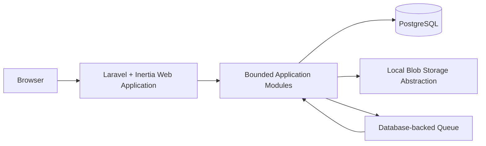

# Architecture Baseline v1 Candidate

Status: **REVIEW CANDIDATE — NOT IMPLEMENTED**.

## Architectural style

v1 is one locally deployable **Modular Monolith**. Backend and frontend are one release unit. Modules own data and expose in-process application services; they do not directly update another module's tables. Transactional domain changes record audit and, when another module must react, a durable internal-message/outbox row processed idempotently.

No microservices, Kafka, Kubernetes, graph database, dedicated search cluster, Redis requirement, primary event sourcing, provider framework, second backend language, or independently deployed frontend is justified for v1.

## Preferred technology stack

- Backend: Laravel / PHP.
- Frontend: Vue 3 + TypeScript.
- Web bridge: Inertia.js.
- Database: PostgreSQL.
- UI: semantic HTML, CSS, Tailwind CSS.
- Local environment: WSL2 + Docker Compose.
- Testing: PHP/Laravel tests plus TypeScript/component tests.

This stack supports transactional relational ownership, a rich Arabic-first web workspace without a separate API/deployment by default, mature authentication and validation, PostgreSQL search/JSONB where bounded, local container repeatability, and testable server/client contracts. There is no deviation from the preferred stack. Exact versions are intentionally unset: Task 006 must inspect the environment, choose currently supported compatible versions, lock dependencies, and record the result.

## Module dependency direction

`MOD-IAM` and `MOD-PLT` provide protected platform capabilities. `MOD-SRC` feeds reviewed evidence to `MOD-KNO`; `MOD-KNO` publishes educational presentations connected by `MOD-CUR`; `MOD-LRN` schedules/assesses activity; `MOD-ENT` provides reusable baseline entities; `MOD-SIM` owns definitions and isolated runs; `MOD-EVD` owns evidence; `MOD-AIB` submits only validated human-reviewed proposals to owning modules. Cycles are broken through stable query/service contracts or recorded messages, never shared-table mutation.

## Persistence and concurrency

Relational columns and constraints are primary. `JSONB` is restricted to registered block/scenario/output payload schemas carrying `type` and `schema_version`; application and database constraints enforce type, size, required keys, and reference resolution. Important commands use transactions, optimistic revision/version checks, idempotency keys, and stable UUID/ULID-style identifiers selected in Task 006. Published revisions are append-only.

## Trust boundaries

1. Browser/session boundary: authenticated owner, CSRF/session protection, safe output encoding.
2. Import boundary: untrusted files/packages enter quarantine and never execute.
3. Manual AI boundary: export is an explicit confidentiality decision; imported data is untrusted.
4. Simulation boundary: commands/actions are interpreted by deterministic rules and cannot reach host execution.
5. Persistence/blob boundary: metadata and digest bind database records to local blobs.
6. Backup/restore boundary: encrypted or access-restricted package, manifest verification, isolated staging.

## Operational model

Core v1 binds locally and requires no public Internet. PostgreSQL full-text search and a database-backed queue are initial services. Blob storage is an interface backed by an application-controlled local directory. External source lookup and manual ChatGPT Plus processing are user-controlled activities outside the core runtime. Specialized workers are deferred until measured processing needs justify an explicit port.

## Quality attributes

- Integrity: immutable custody/publication, transactions, digests, idempotency, audit.
- Security/privacy: least data export, safe rendering/import, local binding, owner authentication.
- Determinism: same scenario revision, baseline snapshot, seed, inputs, and action sequence produce the same trace.
- Recoverability: manifested backups and staged restore verification.
- Accessibility/internationalization: native RTL/LTR semantics, keyboard operation, responsive reflow.
- Maintainability: ten data-owning modules, stable contracts, versioned payload schemas, no miscellaneous module.

This baseline is sufficient to scope Task 006 but is not approval or implementation evidence.

