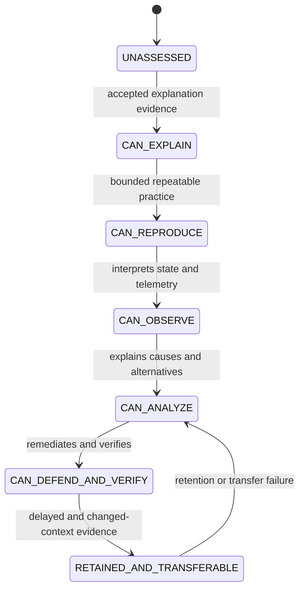

# Curriculum, Learning, and Mastery Model

## Canonical hierarchy

The hierarchy is exactly `Domain -> Capability Cluster -> Capability -> Knowledge Unit`. Each KU has one canonical identity and primary Domain. Typed relationships represent other Domain, role, project, and scenario contexts. The 96 Task 003R rows are provisional candidates, not v1 finished content.

## Lifecycle selection

A `LearningPathTemplate` chooses applicable stages per KU: lesson, diagnostic, micro practice, Guided Simulator Lab, selective Real-Lab claim, evidence rule, mastery evaluation, and failure review. Not every KU requires every stage. Multiple KUs/capabilities can be integrated in a Project or Institutional Scenario.

## Mastery state machine

These names are formalized as v1 candidate states. Transitions are not strictly universal; each Capability owns a provisional `MasteryRuleSet` that declares required evidence types/origins, minimum independent cases, positive/negative paths, recency, retention delay, and transfer context. Threshold values are configuration with `PROVISIONAL_UNCALIBRATED` status until measured.

## Evidence and failure

Reading, watching, or percentage complete cannot by itself advance technical mastery. An evaluation records rule-set revision, input evidence IDs, result, rationale, and reviewer/engine decision. Failures are retained. A `ReviewTrigger` names the failed concept/action/evidence gap, priority, due policy, and linked lesson/practice/lab. Retention decay schedules verification; it does not erase prior evidence.

## Daily queue

Ranking considers prerequisite blocks, capability goal, failed recall/action, missing evidence, weak retention, current project/scenario needs, and unresolved mistakes. Every suggestion shows `why selected`, expected action, evidence need, estimated effort, and whether Real-Lab is optional/recommended/required for a claim. A user may defer with a reason; safety/publication blockers cannot be overridden silently.

