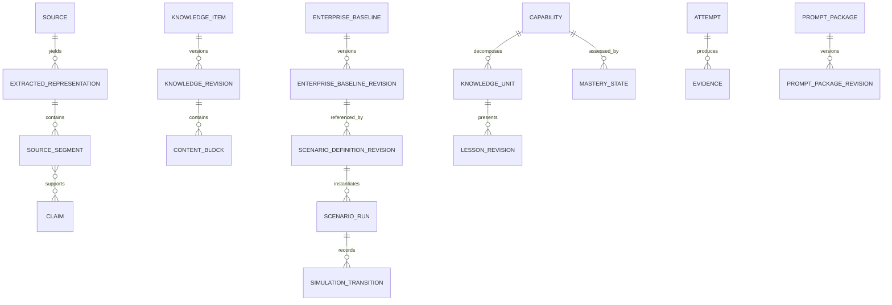

# Logical Data Model

The data model is relational first. The complete owner list is in `planning/task004/ENTITY_CATALOG.tsv` and `DATA_OWNERSHIP_MATRIX.tsv`.

## Identity and audit

`OwnerAccount`, `OwnerCredential`, `ApplicationSession`, and `AuthorizationDecision` belong to MOD-IAM. `AuditRecord` is append-only in MOD-PLT and records actor, action, target type/ID/revision, correlation, timestamp, outcome, and safe structured details. Secrets are referenced, never embedded in audit details.

## Source and publication

`OriginalSource` binds custody URI, byte length, digest, media/type declarations, authorization, import time, and status. `ExtractedRepresentation` records tool/version, input digest, output digest, status, warnings, and schema. `SourceSegment` has stable anchor type/value and content digest. `AuthorityAssessment`, `Claim`, `ClaimSupport`, and `Conflict` keep interpretation distinct from source fact.

`KnowledgeItem` is canonical identity; `KnowledgeRevision` is immutable after publication. `Lesson` is educational identity; `LessonRevision` points to one or more knowledge revisions and owns ordered `ContentBlockRevision` records. Draft and review entities are mutable only before publication. Citation links resolve to `SourceSegment` plus anchor/digest.

## Curriculum and learning

`Domain`, `CapabilityCluster`, `Capability`, and `KnowledgeUnit` preserve the approved hierarchy. Templates bind prerequisites and allowed lifecycle stages. `Diagnostic`, `PracticeDefinition`, `LabDefinition`, `Attempt`, `AttemptEvent`, `MasteryRuleSet`, `MasteryState`, `ReviewTrigger`, and `ReviewSchedule` represent adaptive learning without percent-complete.

## Enterprise and simulation

Catalog entities use stable identities and revisioned relationships. `EnterpriseBaselineRevision` snapshots referenced catalog revisions. `ScenarioDefinitionRevision` declares nodes, actions, rules, transitions, evidence requirements, and validation results. `ScenarioRun` stores baseline snapshot digest, scenario revision, deterministic seed, status, and isolated state. `SimulationTransition` is append-only within a run and records pre-state digest, input, rule version, result, post-state digest, and trace.

## Evidence and Manual AI

`Evidence` records origin, producer, attempt/run link, blob/digest, criteria, applicability, and status. Evidence decisions are versioned. `PromptPackageRevision` records selected source scope, requested schema, manifest, digest, and status; `ImportedResult` records import digest and validations; `AIProposalDecision` records per-change human action. Accepted items call owner services to create drafts only.

## Flexible payload boundary

`JSONB` is limited to `ContentBlockRevision.payload`, `ScenarioNodeRevision.payload`, `SimulationTransition.input/result`, selected evidence metadata, and package schemas. Each requires registered type/schema version, canonical serialization for hashing, field allowlist, size/depth limits, and relational references for owned identities. Searchable/security-critical fields remain relational.

